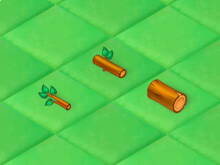
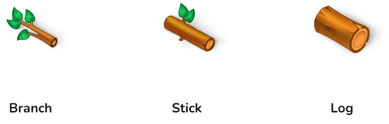

### Задать базовую архитектуру проекта и написать логику механики Merge
---

#### Что такое «Цепочка»
Цепочка — это группа из 3 объектов на игровом поле, связанных между собой по смыслу. Ниже представлен пример цепочки под названием «Дерево»:

#### Как работает механика Merge?
Механика срабатывает, когда игрок объединяет одинаковые элементы цепочки количеством ≥ 3. Если игрок объединяет 3 элемента, он получает 1 элемент следующего уровня. Объединяя 5, он получает 2 следующего уровня. Когда игрок объединяет предшествующие элементы, они трансформируются в следующие по уровню элемента в цепочке: Элемент 1 ур. → Элемент 2 ур. → Элемент 3 ур.
 
> Нюанс: Механика Merge не работает у элементов 3 уровня. На 5, 11 и 17 (и т.д.) количестве объединяемых элементов игрок получает бонусные элементы следующего уровня.

#### Реализовать

##### 1. Фиксацию объектов на игровом поле и механику перемещения

Объекты должны быть перемещаемыми по игровому полю и должны вставать ровно посередине ячейки (Cell) как при изменении в Unity, так и при перетаскивании в рабочей сцене.

##### 2. Merge-3 механику
  

Объединяя Branch, игрок должен получать Stick, а объединяя Stick, игрок должен получать Log.
Merge-3 механика работает, когда игрок перетаскивает 1 объект на группу ≥ 2 идентичных объектов и получает объекты нового уровня рядом с ячейкой, на которой произошло объединение.

> Описанная архитектура механики должна быть универсальна:
>  + Обращение к аргументам могло происходить вне работы механики, например для последующей генерации объектов в каком-либо месте игрового поля
>  + Должна позволять вводить любые новые последующие объекты и создавать с ними полноценные цепочки.

##### 3. Базовую анимацию

Механика Merge должна сопровождаться следующими анимациями (Для их реализации используется плагин DOTween):

+ Когда игрок наводит объект на группу других объектов, снизу должна возникать подсветка.
+ При объединении объектов те должны уменьшаться в точку с последующим исчезновением
+ При появлении объекты должны появляться за счёт увеличения из точки.

